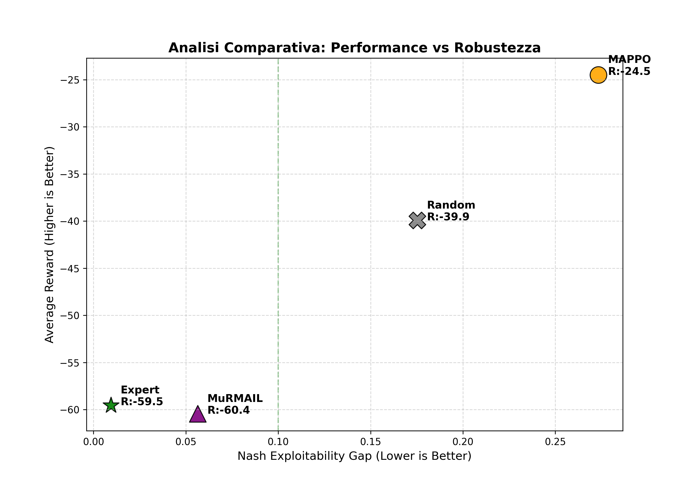

# 🧠 MuRMAIL in Cooperative Speaker–Listener Games

**Stability vs Performance in Multi-Agent Reinforcement Learning**

## Overview

This project studies **MuRMAIL** (Multi-agent Regularized Model-based Imitation Learning) in a **cooperative Speaker–Listener environment**, with a specific focus on the relationship between:

* **Strategic stability** (Nash exploitability / unilateral improvement gap)
* **Empirical performance** (average episodic reward)

Rather than evaluating agents solely on reward maximization, we analyze how different learning approaches behave with respect to **equilibrium stability** in a cooperative Dec-POMDP.

---

## Environment

* **Task**: Cooperative Speaker–Listener navigation
* **Setting**: Decentralized POMDP (Dec-POMDP)
* **Reward**: Shared team reward (both agents maximize the same signal)
* **Dynamics**: Continuous environment discretized into a finite MDP
* **Episode length**: 25 steps

This is a **team game**, not zero-sum:
$$
R_{\text{speaker}} = R_{\text{listener}}
$$

---

## Compared Methods

| Method      | Description                                                            |
| ----------- | ---------------------------------------------------------------------- |
| **Expert**  | Model-based joint policy computed on the discretized MDP (upper bound) |
| **MuRMAIL** | Imitation learning from the Expert with regularization                 |
| **MAPPO**   | Model-free multi-agent PPO (independent execution)                     |
| **Random**  | Uniform random baseline                                                |

---

## Evaluation Metrics

### 1. Nash Exploitability (Unilateral Improvement Gap)

We compute a **Nash-style exploitability metric** adapted to cooperative games:

[
\text{Gap} =
V(\text{BR}_S, \pi_L) +
V(\pi_S, \text{BR}_L) -
2V(\pi_S, \pi_L)
]

* Measures **how much a single agent can improve the team reward by deviating unilaterally**
* Gap = 0 ⇒ **stable joint policy**
* Lower is better

> In cooperative games, Nash equilibrium corresponds to a **joint policy where no agent can increase the shared reward alone**.

---

### 2. Average Episodic Reward

* **Expert & MuRMAIL**: evaluated model-based using the learned MDP
* **MAPPO & Random**: evaluated empirically in the environment
* Rewards are **raw (non-normalized)** and **negative**, as defined by the task

---

## Final Results

### 📊 Quantitative Comparison

| Method      | Nash Gap ↓ | Avg Reward |
| ----------- | ---------- | ---------- |
| **Expert**  | **0.009**  | -59.5      |
| **MuRMAIL** | **0.056**  | -60.4      |
| Random      | 0.175      | -39.9      |
| MAPPO       | **0.273**  | **-24.5**  |

### 🔍 Interpretation

* **Expert** achieves near-zero exploitability → highly stable joint policy
* **MuRMAIL** closely matches the Expert, inheriting its stability
* **MAPPO** obtains higher reward but is **strategically unstable**
* **Random** performs poorly and is unstable, as expected

> **Higher reward does not necessarily imply higher strategic stability.**

---

## Visualization

The final plot jointly represents:

* **X-axis**: Nash Exploitability (lower = more stable)
* **Y-axis**: Average Reward (higher = better performance)

This highlights a clear **stability–performance trade-off**:

* **Expert / MuRMAIL** → stable but conservative
* **MAPPO** → high reward but exploitable

<p align="center">
  
</p>

---

## Key Takeaways

* MuRMAIL **successfully imitates a stable expert policy**
* Stability and performance are **distinct objectives**
* Model-free MARL methods may exploit environment dynamics at the cost of equilibrium stability
* Nash-style exploitability is a **meaningful metric even in cooperative games**


---

## Reproducibility

1. Generate the expert model:

```bash
python generate_expert.py
```

2. Run final evaluation:

```bash
python final_analysis_cont.py
```

Outputs:

* `final_thesis_plot.png`
* `final_thesis_table.csv`

---

## Conclusion

This project demonstrates that **MuRMAIL is effective at learning stable cooperative policies**, even when higher-reward but unstable alternatives exist.

The results emphasize the importance of **equilibrium-aware evaluation** in multi-agent reinforcement learning, especially in cooperative settings.

---
